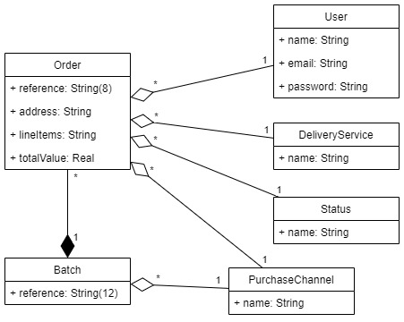

# AutoForce - Backend Challenge

Challenge requirements: [API_REQUIREMENTS.md](API_REQUIREMENTS.md)

Challenge proposed by: https://autoforce.com

Challenge proposed in: https://github.com/autoforce/backend-challenge


# Entities

Class diagram:



**Future improvement:** Analyze the best way to work with the "line_items" field.


# API endpoints

## POST: /orders - Create a new Order

Parameters:
 * reference: String!
 * address: String!
 * line_items: String!
 * total_value: Real!
 * user_id: ID!
 * purchase_channel_id: ID!
 * delivery_service_id: ID!

Notes: order.status = ready

Result: Order


## GET: /orders - Get the status of an Order and List the Orders of a Purchase Channel

Parameters:
 * reference: String
 * user_id: ID
 * status_id: ID
 * purchase_channel_id: ID
 * delivery_service_id: ID
 * offset: Integer
 * limit: Integer

Result: [Order]!


## POST: /batches - Create a Batch

Parameters:
 * purchase_channel: ID!

Notes:
 * batch.reference = "YYYYMM-increment"
 * batch.orders.status = production

Result: { reference: String, countOrders: Integer }


## PATCH/PUT: /batches - Produce a Batch and Close part of a Batch for a Delivery Service

Parameters:
 * batch: ID!
 * delivery_service: ID

Notes:
```
if batch.orders.status == closing:
  delivery_service is required
  batch.orders.status = sent
else:
  batch.orders.status = closing
```

Result: Batch


## GET:/report - A simple financial report

Result: [{ purchase_channel: PurchaseChannel, count_orders: Integer, sum_total: Real }]
